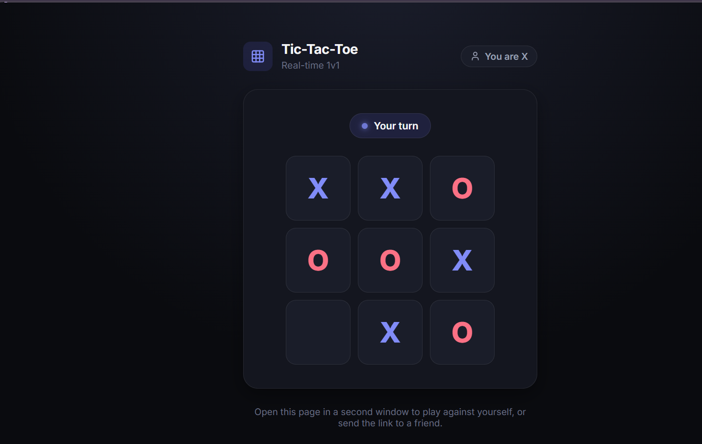

# Tic-Tac-Toe

A real-time, 1v1 multiplayer Tic-Tac-Toe game built with **ASP.NET Core** and **SignalR**, with a clean web-based UI.



## Features

- Real-time 1v1 matchmaking — the first two players to connect are paired automatically
- Server-authoritative game state (no client-side cheating)
- Animated winning line drawn across the three matching cells
- Win/lose/draw popup with a "Play Again" option
- Clean, modern dark-themed UI with smooth animations

## Tech stack

- **Backend:** ASP.NET Core, SignalR
- **Frontend:** HTML, CSS, vanilla JavaScript, SignalR JS client
- **Fonts/Icons:** Inter (Google Fonts), Lucide Icons

## Getting started

### Prerequisites

- [.NET 8 SDK](https://dotnet.microsoft.com/download)

### Run locally

```bash
git clone https://github.com/muthokaricky-alt/TicTacToe.git
cd TicTacToe
dotnet run
```

Open the URL printed in the terminal (e.g. `http://localhost:5000`) in **two separate browser windows** to play as both players.

## How it works

- The first player to connect becomes **X** and waits for an opponent.
- The second player to connect becomes **O**, and the game starts immediately.
- Moves are validated server-side (correct turn, empty cell) before being broadcast to both players.
- When a player gets three in a row, a line animates across the winning cells and a result popup appears for both players.

## Project structure

```
TicTacToe/
├── Program.cs              # App startup and SignalR hub mapping
├── Hubs/
│   ├── GameHub.cs           # SignalR hub: connections, moves, disconnects
│   └── GameManager.cs        # Matchmaking, game state, win detection
└── wwwroot/
    ├── index.html
    ├── css/style.css
    └── js/game.js
```

## Possible next steps

- In-place rematch instead of a full page reload
- Lobby/room codes instead of first-come-first-pair matchmaking
- Reconnect handling for dropped connections
